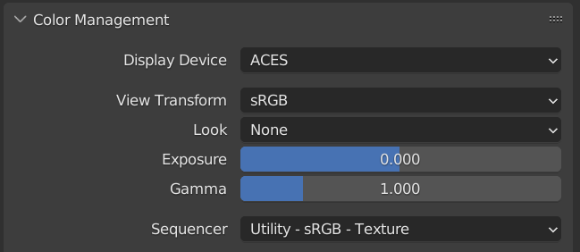
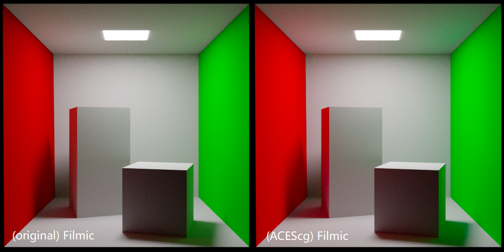
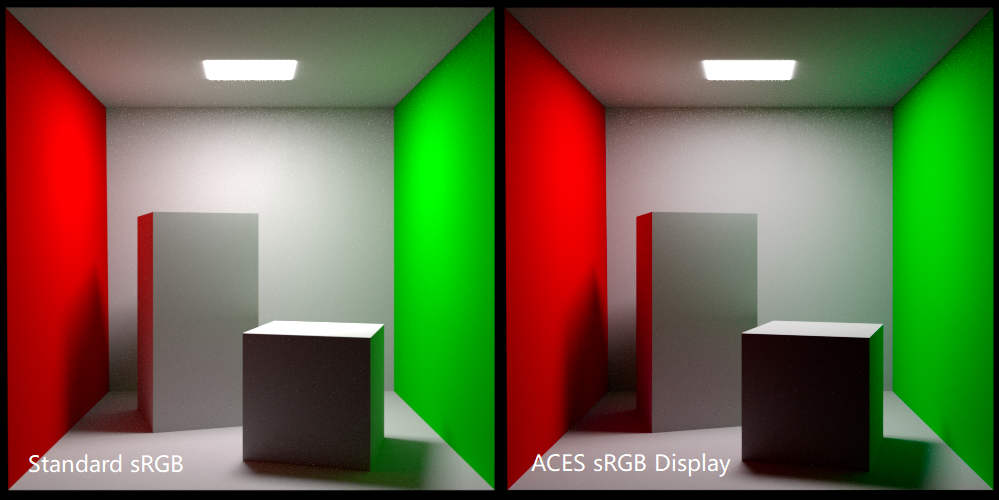

# ACES Config for Blender


## About The Project

This project can be your starting point of ACES workflow in Blender.

- [x] Default display mappings from Blender are retained. (e.g.,  standard sRGB, filmic, filmic log)
- [x] Default *Looks* are also retained.
- [x] ACES 1.3 ([Release note](https://community.acescentral.com/t/aces-1-3-now-available/3739))
- [x] Blender 3.1


## Getting Started

#### Method 1 - Overwrite color management folder

- Backup default color management folder.

  It depends on your installation location, for example:

  `C:\Program Files\Blender Foundation\Blender 3.1\3.1\datafiles\colormanagement`

- Copy these items into Blender's `colormanagement` folder.
  - `config.ocio`
  - `luts`
  - `filmic`
  - `aces_luts`
- Open Blender and check `Color Management` panel in `Render Properties`.



- Done.


#### Method 2 - Start Blender from a batch file

Here is an Windows batch file example, assuming Blender-ACES-Config has been cloned into `D:\Blender-ACES-Config` and Blender has been installed at `C:\Program Files\Blender Foundation\Blender 3.1\`.

```
set OCIO=D:\Blender-ACES-Config\config.ocio

start "Blender (ACES workflow)" "C:\Program Files\Blender Foundation\Blender 3.1\blender.exe"
```

Copy the script to a text file, edit the paths according to your situation and save the text file with `.bat` extension. Then run Blender using the batch file.

The advantage of this method is that you can use Blender without ACES config by launching from desktop shortcuts or start menu as usual.


#### Method 3 - Set environment variable

Blender uses the [OCIO](https://opencolorio.org/) standard environment variable - `OCIO` -  to read an OCIO configuration. So you can set the `OCIO` environment variable to the path of your configuration.

**But this is a highly discouraged method.** It can mess up other software which uses OCIO as color management backend. Blender should provide an alternative environment variable, for example `BLENDER_OCIO`，to avoid this problem.


## Showcase

*Left*: original filmic sRGB display transform (in which scene linear color space uses sRGB color primaries).

*Right*: ACES workflow filmic sRGB display transform (in which scene linear color space uses [AP1](https://en.wikipedia.org/wiki/Academy_Color_Encoding_System#ACEScg))



----

*Left*: standard sRGB display:

- Blender built-in workflow (in which scene linear uses sRGB color primaries)

*Right*: ACES sRGB display:

- ACES workflow (in which scene linear uses AP1 color primaries)
- sRGB display ([RRT](https://en.wikipedia.org/wiki/Academy_Color_Encoding_System#System_overview) + sRGB output)





## Related Projects

[ACES v1.3 config and LUTs](https://github.com/Ginurx/OpenColorIO-Configs)

[Blender](https://www.blender.org/)

[OpenColorIO](https://opencolorio.org/)

[ACES](https://acescentral.com/)
